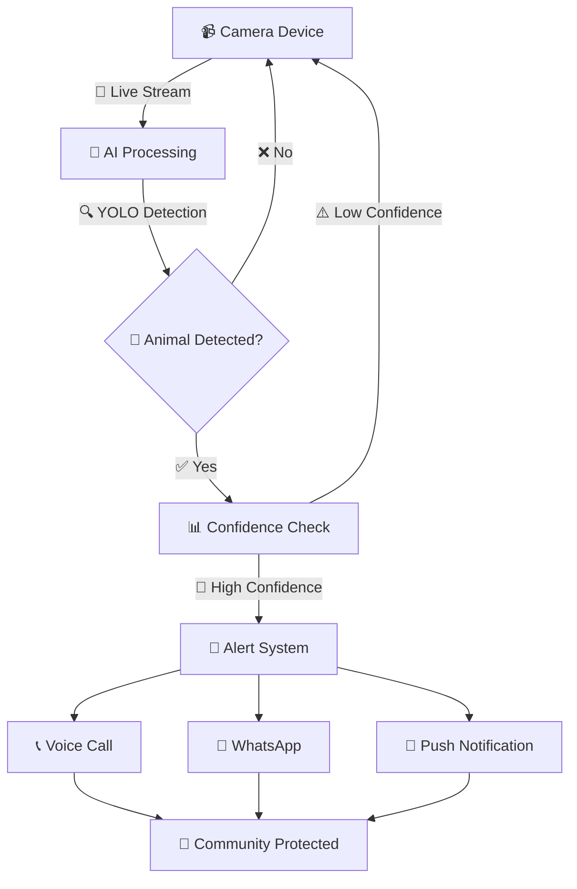

# 🦌 Wildlife Alert System
### *Real-Time Animal Detection & Community Alert Platform*

<div align="center">


**🔥 AI-Powered Wildlife Detection • 📱 Real-Time Alerts • 🌍 Community Safety**

</div>

---

## 🚀 **What Makes This Special?**

> **Revolutionary wildlife detection system** that combines **YOLO v11 AI**, **WebRTC streaming**, and **instant community alerts** to protect both wildlife and communities in Nepal.

## ✨ **Core Features**

<table>
<tr>
<td width="50%">

### 🎯 **AI Detection Engine**
- 🤖 **YOLO v11** - State-of-the-art object detection
- 🎯 **96%+ Accuracy** for wildlife identification
- ⚡ **Real-time processing** with GPU acceleration
- 🔍 **Smart sampling** for optimal performance

</td>
<td width="50%">

### � **Live Streaming**
- 🌐 **WebRTC** - Ultra-low latency streaming
- 📱 **Multi-device** support (phones, tablets, cameras)
- 🔄 **Auto-reconnection** & smart device management
- 🎥 **HD Quality** video transmission

</td>
</tr>
<tr>
<td width="50%">

### � **Instant Alerts**
- 📞 **Voice Calls** via TingTing API
- 💬 **WhatsApp** notifications with video clips
- 🔔 **Push notifications** to subscribed users
- ⏰ **Smart cooldown** prevents alert spam

</td>
<td width="50%">

### �️ **Admin Control**
- 🎛️ **Professional dashboard** for camera management
- 🏠 **Location-based** organization
- 🔒 **Secure authentication** & token management
- 📊 **Real-time status** monitoring

</td>
</tr>
</table>

## 🦁 **Detected Animals**

<div align="center">

### 🚨 **Dangerous Species** *(Immediate Community Alert)*
| Animal | नेपाली | Detection | Alert Type |
|--------|---------|-----------|------------|
| 🐘 Elephant | हात्ती | 96% accuracy | 📞 Voice + 💬 WhatsApp |
| 🐆 Leopard | चितुवा | 94% accuracy | 📞 Voice + 💬 WhatsApp |
| 🦏 Rhino | गैंडा | 98% accuracy | 📞 Voice + 💬 WhatsApp |
| 🐅 Tiger | बाघ | 95% accuracy | 📞 Voice + 💬 WhatsApp |

### 🔒 **Endangered Species** *(Wildlife Authority Alert)*
| Animal | नेपाली | Detection | Alert Type |
|--------|---------|-----------|------------|
| 🐼 Red Panda | रातो पाण्डा | 92% accuracy | 📧 Official Channels |

</div>

---

## ⚡ **Quick Start**

### 🔧 **Installation**
```bash
# 📦 Install dependencies
pip install -r requirements.txt

# 🔐 Generate SSL certificates (HTTPS required)
python generate_ssl.py

# 🚀 Launch the system
python app.py
```

### 🌐 **Access Points**
```
🔒 Admin Panel:    https://localhost:8443/admin
👀 Public View:    https://localhost:8443/
📹 Camera Setup:   https://localhost:8443/camera/{token}
```

> **🔑 Default Admin:** `admin` / `admin123`

## 🎯 **How It Works**

<div align="center">



</div>

### 📋 **Step-by-Step Process**

| Step | Action | Description |
|------|--------|-------------|
| 🔴 **1** | **Camera Setup** | Admin creates camera location in dashboard |
| 🟡 **2** | **Device Connection** | Field camera connects via unique token |
| 🟢 **3** | **Live Streaming** | WebRTC streams video to AI processing engine |
| 🔵 **4** | **AI Analysis** | YOLO v11 analyzes frames for wildlife detection |
| 🟣 **5** | **Smart Alerts** | Multi-channel notification system activated |
| ⚫ **6** | **Community Safety** | Real-time protection for humans and animals |

## API Endpoints

- `GET /` - Home page with camera search
- `GET /admin` - Admin panel (requires authentication)
- `POST /admin/camera` - Create new camera
- `DELETE /admin/camera/{id}` - Delete camera
- `GET /view/{slug}` - Public viewing page
- `GET /camera/{token}` - Camera streaming page
- `WebSocket /ws/camera/{token}` - Camera streaming WebSocket
- `WebSocket /ws/view/{token}` - Viewer WebSocket
- `POST /subscribe/{camera_id}` - Subscribe to notifications
- `GET /search?q={query}` - Search cameras

## 🛠️ **Technology Stack**

<div align="center">

### 🧠 **AI & Machine Learning**


### 🌐 **Backend & API**


### 📱 **Frontend & Real-time**


### 🔔 **Communication**


</div>

---

## 🏗️ **System Architecture**

```
                    🌍 WILDLIFE ALERT ECOSYSTEM
    
┌─────────────────┐    ┌──────────────────┐    ┌─────────────────┐
│  📹 Field       │    │   🤖 AI Engine   │    │  👥 Community   │
│  Cameras        │◄──►│   YOLO v11       │◄──►│  Dashboard      │
│                 │    │   Detection      │    │                 │
│  • WebRTC       │    │   • GPU Accel    │    │  • Live View    │
│  • HD Stream    │    │   • Smart Sample │    │  • Alerts       │
│  • Auto Connect │    │   • 96% Accuracy │    │  • Subscribe    │
└─────────────────┘    └──────────────────┘    └─────────────────┘
                               │
                    ┌──────────▼──────────┐
                    │   🚨 Alert Hub      │
                    │                     │
                    │  📞 Voice Calls     │
                    │  💬 WhatsApp        │
                    │  🔔 Push Notify     │
                    │  ⏰ Smart Cooldown  │
                    └─────────────────────┘
```

## 🔐 **Security & Performance**

<table>
<tr>
<td width="50%">

### 🛡️ **Security Features**
- 🔒 **Token-based authentication** for cameras
- 🔐 **HTTPS encryption** for all communications
- 🚫 **CORS protection** against unauthorized access
- 🎫 **Unique camera tokens** prevent hijacking
- 📝 **Input validation** & sanitization

</td>
<td width="50%">

### ⚡ **Performance Optimizations**
- 🚀 **GPU acceleration** for AI processing
- 🎯 **Smart frame sampling** reduces load
- 💾 **Memory efficient** processing pipeline
- 🔄 **Auto-reconnection** for reliability
- ⏰ **Alert cooldown** prevents spam

</td>
</tr>
</table>

---

## 🌟 **Key Benefits**

<div align="center">

| 🎯 **For Communities** | 🌍 **For Wildlife** | 🏛️ **For Authorities** |
|------------------------|---------------------|------------------------|
| ⚡ Real-time protection | 🔒 Habitat monitoring | 📊 Data-driven insights |
| 📱 Instant notifications | 🚫 Reduced human conflict | 📈 Population tracking |
| 🏠 Residential safety | 🦌 Species preservation | 🎯 Targeted conservation |
| 👥 Community alerts | 📍 Movement patterns | 📋 Incident reporting |

</div>

## 🚀 **Production Deployment**

### 🌍 **Ready for Scale**

```bash
# 🔒 SSL Certificate Setup
certbot --nginx -d yourdomain.com

# 🐳 Docker Deployment
docker-compose up -d

# 🚀 Production Server
gunicorn -w 4 -k uvicorn.workers.UvicornWorker app:app
```

### ⚙️ **Environment Configuration**
```bash
export SSL_CERT_PATH="/path/to/cert.pem"
export SSL_KEY_PATH="/path/to/key.pem" 
export ADMIN_USERNAME="your_admin"
export ADMIN_PASSWORD="secure_password"
```

---

## 🔧 **API Reference**

| Endpoint | Method | Description | 🎯 Purpose |
|----------|--------|-------------|------------|
| `/` | GET | 🏠 Home dashboard | Search & view cameras |
| `/admin` | GET | 🎛️ Admin panel | Manage system |
| `/camera/{token}` | GET | 📹 Camera interface | Device streaming |
| `/view/{slug}` | GET | 👀 Public viewer | Community monitoring |
| `/ws/camera/{token}` | WS | 🔄 Camera stream | Real-time video |
| `/ws/view/{token}` | WS | 📺 View stream | Live viewing |
| `/subscribe/{id}` | POST | 🔔 Alert subscription | Notification signup |

---

## 🆘 **Troubleshooting**

<details>
<summary>📹 <strong>Camera Issues</strong></summary>

- ✅ **Check HTTPS**: Camera access requires secure connection
- 🔐 **Browser Permissions**: Allow camera/microphone access
- 🌐 **WebRTC Support**: Use modern browsers (Chrome, Firefox, Safari)
- 🔄 **Refresh Connection**: Clear browser cache if needed

</details>

<details>
<summary>🔔 <strong>Alert Problems</strong></summary>

- 📱 **Service Worker**: Ensure notifications are enabled
- 🔐 **HTTPS Required**: Push notifications need secure connection
- 🔑 **VAPID Keys**: Verify configuration in production
- ⏰ **Cooldown Active**: Check if alert cooldown is preventing notifications

</details>

<details>
<summary>🤖 <strong>AI Detection Issues</strong></summary>

- 🎯 **Model Loading**: Ensure YOLO weights are downloaded
- 💾 **GPU Memory**: Check CUDA availability and memory
- 🖼️ **Image Quality**: Ensure good lighting and clear view
- ⚡ **Processing Speed**: Monitor CPU/GPU usage

</details>

---

## 📄 **License**

<div align="center">

**MIT License** - Open Source & Free to Use

[](https://opensource.org/licenses/MIT)

*Built with ❤️ for wildlife conservation and community safety*

</div>
